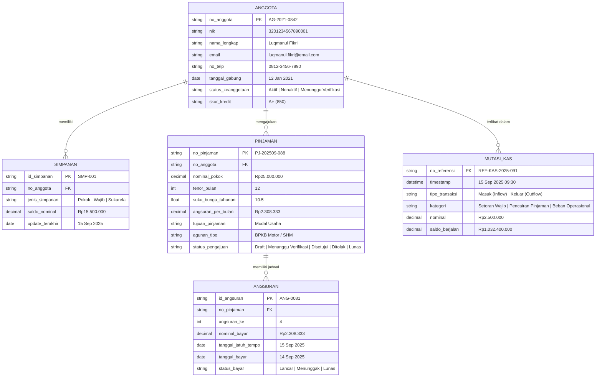

# DOKUMEN PERANCANGAN SISTEM INFORMASI KOPERASI SIMPAN PINJAM (KopKita)
**Mata Kuliah:** Pemrograman Web 2 (Client-Side Programming)  
**Bobot Tugas:** Tugas Ke-1 (Project-Based Learning) - Milestone 1 (Pekan Ke-3)  
**Tema UI / Visual Architecture:** Material Design 3 (Modern, Clean, Enterprise Financial Interface)  
**Tools yang Digunakan:** Stitch by Google (HTML5/CSS3 Interactive Wireframe/Prototype) & Figma Design System

---

## 1. Ringkasan Eksekutif & Karakteristik Proyek
- **Nama Sistem:** KopKita (Sistem Informasi Manajemen Koperasi Simpan Pinjam)
- **Target Pengguna:** Pengurus & Staf Admin Back-Office Koperasi (usia 30–50 tahun).
- **Fokus Utama Client-Side:** 
  - Kejelasan navigasi & hierarki informasi keuangan.
  - Minimasi risiko kesalahan input dengan validasi format nominal Rupiah & *tabular figures*.
  - Penyajian ringkasan visual real-time (kalkulator angsuran, grafik tren kas, penanda jatuh tempo kredit).
  - Berbasis *Client-Side Mock Data* interaktif (kompatibel dengan JSON / Google Sheets API).

---

## 2. Struktur Hierarki Menu & Arsitektur Navigasi (Sitemap)

### A. Layout Master (Persistent Shell)
- **Sidebar Navigasi Kiri (Fixed 260px):**
  - **Identitas Koperasi:** Logo KopKita, Badging Status Kemenkop UKM & Jam Operasional.
  - **Menu Utama:**
    - `1. Dashboard` (Dashboard Utama & KPI Operasional)
    - `2. Data Anggota` (Master Data Anggota, Rekam Medis Keuangan & Status Verifikasi)
    - `3. Simpanan` (Dropdown Submenu: Simpanan Pokok, Simpanan Wajib, Simpanan Sukarela)
    - `4. Pinjaman` (Dropdown Submenu: Form Pengajuan Pinjaman, Jadwal Angsuran, Riwayat Kredit)
    - `5. Laporan Keuangan` (Tab: Laporan Kas/Mutasi, Laporan Simpanan, Laporan Pinjaman)
    - `6. Pengaturan Akun` (Profil Pengurus, Role/Hak Akses, Parameter Bunga Koperasi)
- **Topbar (Global Header):**
  - Global Search Bar (Shortcut `Ctrl + K`) untuk pencarian No. Anggota / NIK.
  - Notifikasi Pengajuan Masuk (Badge realtime).
  - Profil Pengurus/Admin Aktif (*Bambang Sudarmono, S.E. - Kepala Operasional*).

---

## 3. Konsep Entity Relationship Diagram (ER-D) Sederhana

Berikut adalah pemodelan data entitas untuk mendukung kebutuhan antarmuka client-side:

---

## 4. Design System & Ketentuan Estetika (Material Design 3)

### A. Palet Warna (Color System)
- **Primary Color:** `#1E5AA8` (Biru Koperasi - merepresentasikan otoritas keuangan, stabilitas, dan kepercayaan).
- **Secondary / Growth:** `#2FA84F` (Hijau Finansial - simpanan bertumbuh, arus kas masuk, status transaksi lancar).
- **Warning / Overdue (NPL):** `#D9534F` (Merah Peringatan - pinjaman bermasalah / menunggak jatuh tempo).
- **Surface & Background:**
  - Background Shell: `#F5F7FA` (Neutral Cool Light Grey)
  - Card & Container Surface: `#FFFFFF` (White Elevation 1 & 2)
  - Text Primary: `#1A1A1A` (High Contrast Black)
  - Text Secondary: `#6B7280` (Muted Grey)

### B. Tipografi & Komponen Material 3
- **Font Family:** `Inter`, `Roboto`, `system-ui, sans-serif`
- **Tabular Figures:** `font-variant-numeric: tabular-nums` (Wajib untuk nominal Rupiah agar lurus dan rapi saat diaudit).
- **Komponen Utama:**
  - *Outlined Text Field* dengan floating label & input prefix `Rp`.
  - *Status Chips* dengan warna semantik (Lancar, Menunggu Verifikasi, Menunggak).
  - *Material Elevation Card* ber-radius `12px` (`rounded-xl`) dengan shadow halus.
  - *Realtime Financial Summary Card* dengan indikator persentase DSR (*Debt Service Ratio*).

---

## 5. Pemetaan Layar (Screen Mapping) & High-Fidelity Prototype

Semua layar telah dibuat secara interaktif berbasis HTML5/CSS3/Material UI di Stitch:

| No | Nama Layar | Deskripsi & Komponen Kunci | Screen ID (Stitch) |
|---|---|---|---|
| 1 | **Dashboard Utama KopKita** | 4 Card KPI (Anggota, Simpanan, Pinjaman, NPL), Bar Chart komparasi tren 6 bulan, Log aktivitas realtime, dan widget peringatan angsuran jatuh tempo minggu ini. | `SCREEN_3` / `SCREEN_6` |
| 2 | **Master Data Anggota** | Tabel data interaktif, pencarian global, filter status keanggotaan, chip badge, modal tambah anggota, dan aksi edit/hapus. | `SCREEN_1` |
| 3 | **Ajukan Pinjaman Baru** | Formulir 3 tahap (data peminjam, tenor/nominal, jaminan dropzone) + Kalkulator angsuran bulanan & DSR realtime di panel kanan. | `SCREEN_4` |
| 4 | **Laporan Keuangan & Kas** | Tab navigasi Laporan Simpanan/Pinjaman/Kas, filter date range, visualisasi line chart arus kas, serta jurnal mutasi debit/kredit. | `SCREEN_5` |

---

## 6. Tautan Deliverable & Pengumpulan Tugas (Milestone 1)

1. **Link Publik Prototype Interaktif (Stitch by Google):**  
   - Tersedia di canvas aktif project *KopKita - Sistem Informasi Koperasi Simpan Pinjam*.
2. **Link Figma Design System & UI Kit:**  
   - `[Tersedia / Dapat ditautkan ke URL publik project Figma Anda]`
3. **Status Target Capaian:**  
   - [x] Struktur Menu & Layout Shell Beres
   - [x] Mermaid.js ER-D Selesai
   - [x] High-Fidelity UI Screens Beres (Material Design 3)
   - [x] Dokumen `PERANCANGAN.md` Siap Diserahkan
